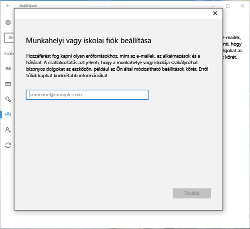
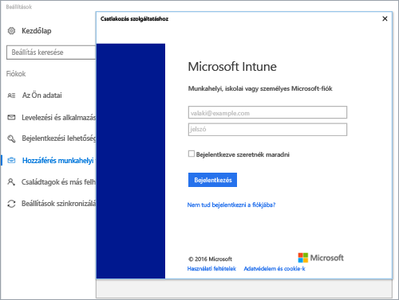
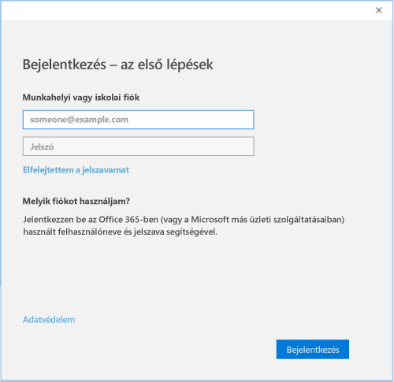

# Windows 10-es eszközök regisztrálása Intune Céges portál

A Intune Céges portál használatával regisztrálja Windows 10-es eszközét a szervezet felügyelete alatt. Ez a cikk azt ismerteti, hogyan regisztrálhat eszközöket a Windows 10 1607-es vagy újabb verziójával, valamint a Windows 10 1511-es és korábbi verzióival. Mielőtt elkezdené, győződjön meg róla, hogy [ellenőrzi a verziót az eszközön](windows-enrollment-company-portal.md#find-windows-10-version-number) , hogy kövesse a megfelelő lépéseket.  

A Windows 10 számos különböző típusú eszközön támogatott, beleértve az asztali, a telefonos és a táblaszámítógépeket. A regisztrációs lépések ugyanazok, mint a használt eszközön. Előfordulhat azonban, hogy a képernyőn egy kicsit eltérnek a jelen cikkben látható képektől.  
 
> [!VIDEO https://www.youtube.com/embed/TKQxEckBHiE?rel=0]

## Windows 10 1607-es és újabb verziójú eszköz regisztrálása 
Ezek a lépések bemutatják, hogyan regisztrálhat olyan eszközt, amely a Windows 10 1607-es és újabb verzióin fut.  

1. Lépjen a **Start** menüre. Ha Windows 10 Mobile rendszerű eszközön van, folytassa a **minden alkalmazás** listával.

2. Nyissa meg a **Beállítások** alkalmazást. Ha az alkalmazás nem érhető el az alkalmazások listájában, ugorjon a keresősáv elemre, és írja be a "Settings" (beállítások) kifejezést.

3. Válassza a **Fiókok** > **Hozzáférés munkahelyi vagy iskolai rendszerhez** > **Csatlakozás** elemet.  

      

4. A szervezet Intune bejelentkezési oldalának beszerzéséhez adja meg a munkahelyi vagy iskolai e-mail-címét. Ezután válassza a **tovább**lehetőséget.  

     

5. Jelentkezzen be az Intune-ba munkahelyi vagy iskolai fiókjával.  

      

    Végül megjelenik egy üzenet arról, hogy a vállalata vagy iskolája regisztrálja az eszközt.

6. Ha a szervezete megköveteli a Windows Hello PIN-kódjának beállítását, a rendszer kérni fogja egy ellenőrző kód megadását. Adja meg a kódot, és folytassa a képernyőn megjelenő lépéseket a PIN-kód létrehozásához.  

7. Minden készen **van!** képernyő, válassza a **Kész** elemet. Ezzel megtörtént az eszköz regisztrálása.  

8. Ha szeretné megtekinteni a kapcsolatot, térjen vissza a **beállítások** > **fiókok** > **hozzáférés munkahelyi vagy iskolai**rendszerhez.  A fiókjának most már szerepelnie kell.  

      

Még mindig nem fér hozzá a munkahelyi vagy iskolai e-mailjeihez, fájljaihoz vagy egyéb adataihoz? Útmutató a [fiókok problémáinak elhárításához](troubleshoot-your-windows-10-device-windows.md#troubleshooting-steps-to-follow-if-you-see-access-work-or-school).  

## Windows 10 1511-es és korábbi verziójú eszköz regisztrálása  
Ezek a lépések bemutatják, hogyan regisztrálhat olyan eszközt, amely a Windows 10 1511-es és korábbi verzióiban fut.  

1. Lépjen a **Start** menüre. Ha Windows 10 Mobile rendszerű eszközön van, folytassa a **minden alkalmazás** listával.

2. Nyissa meg a **Beállítások** alkalmazást. Ha az alkalmazás nem érhető el az alkalmazások listájában, ugorjon a keresősáv elemre, és írja be a "Settings" (beállítások) kifejezést.

3. Válassza a **fiókok** > **a fiókját**.  

      

5. Válassza a **Munkahelyi vagy iskolai fiók beállítása** lehetőséget.  

      

6. Jelentkezzen be a munkahelyi vagy iskolai fiókjával.  

      

Még mindig nem fér hozzá a munkahelyi vagy iskolai e-mailjeihez, fájljaihoz vagy egyéb adataihoz? Megtudhatja, hogyan lehet [elhárítani a fiókokkal kapcsolatos problémákat](troubleshoot-your-windows-10-device-windows.md#troubleshooting-steps-to-follow-if-you-see-your-account) a regisztráció során.  

## INFORMATIKAI rendszergazda támogatása   

Ha Ön rendszergazda, és az eszközök regisztrálása során problémákba kerül, tekintse meg [a Windows-eszközök regisztrálásával kapcsolatos problémák elhárítása Microsoft Intune](https://support.microsoft.com/help/4469913). Ez a cikk a gyakori hibákat, azok okait és a megoldás lépéseit sorolja fel. 

## További lépések  
Ha segítségre van szüksége a Céges portál vagy a regisztrációhoz, lépjen kapcsolatba a szervezet informatikai támogatási csapatával. A kapcsolattartási adatokat a [céges portál webhelyén](https://go.microsoft.com/fwlink/?linkid=2010980)találja. Jelentkezzen be a webhelyre munkahelyi vagy iskolai fiókjával.  

 

