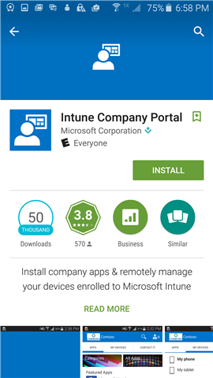

# A Céges portál alkalmazás telepítése Androidhoz

A Céges portál alkalmazás hozzáférést biztosít a munkahelyi és az iskolai alkalmazásokhoz, valamint a levelezéshez és az internetkapcsolatokhoz. Ez az alkalmazás az ön eszköze biztonságának garantálásával munkahelye információinak is védelmet nyújt − például naprakészen tarja a vállalati alkalmazásait vagy gondoskodik róla, hogy az eszköze egy bizonyos idő elteltével lezárja magát. Ha többet szeretne megtudni a Céges portál szolgáltatásairól és az eszközök felügyeletéről, olvassa el az [Android-eszköz regisztrálásával](why-enroll-android-device.md)foglalkozó témakört.  

1. Kattintson a **Home** (Kezdőképernyő) > **Play Store** (Play Áruház) elemre.

2. A keresőmezőbe írja be az **Intune vállalati portál** **kifejezést** .  

3. Koppintson az **Intune Céges portál** elemre.

    

4. Koppintson a **TELEPÍTÉS** elemre.

    

5. Koppintson az **ELFOGADÁS** gombra.

    

Az Céges portál alkalmazás letöltése után valószínűleg regisztrálni szeretné az [eszközét az Intune-ban](enroll-device-android-company-portal.md) , hogy teljes hozzáférést kapjon a munkahelyi adatokhoz. További lehetőség: [Bejelentkezés más eszköz használatával](https://docs.microsoft.com/intune-user-help/sign-in-to-the-company-portal#sign-in-from-another-device).  

További segítségre van szüksége? Forduljon a cég informatikai támogatásához. Az elérhetőségét keresse meg a [Vállalati portál webhelyén](https://go.microsoft.com/fwlink/?linkid=2010980).
