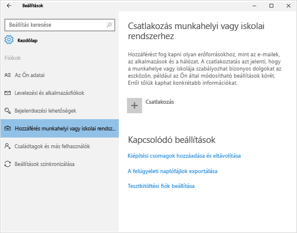
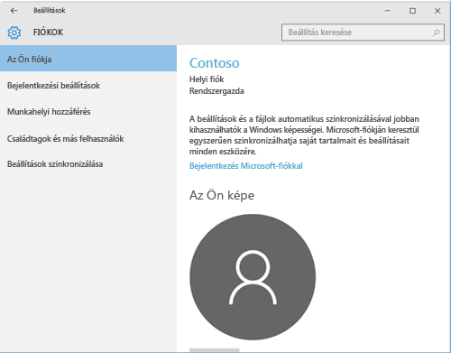
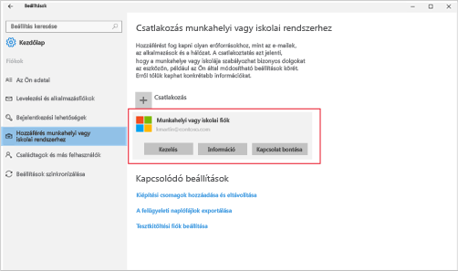

# Windows 10-es eszközök regisztrálásával kapcsolatos problémák elhárítása
Ha regisztrálta az eszközt, de továbbra sem tud hozzáférni a munkahelyi vagy iskolai e-mailekhez és fájlokhoz, próbálja meg ezeket a hibaelhárítási lépéseket.  

1. A következő két képernyő közül válassza ki azt, amelyen ugyanaz látszik, mint az eszközön. Hajtsa végre a kiválasztott képernyőhöz tartozó lépéseket.

    Ha ezt a képernyőt látja, hajtsa végre a [Hibaelhárítási lépések, ha ezt látja: Hozzáférés munkahelyi vagy iskolai rendszerhez](#troubleshooting-steps-to-follow-if-you-see-access-work-or-school) című részben leírt lépéseket.

    

    Ha ezt a képernyőt látja, hajtsa végre a [Hibaelhárítási lépések, ha ezt látja: Saját fiók](#troubleshooting-steps-to-follow-if-you-see-your-account) című részben leírt lépéseket.

    

## Hibaelhárítási lépések, ha ezt látja: „Hozzáférés munkahelyi vagy iskolai rendszerhez”

1. Ha követte a fenti lépéseket, de továbbra sem tud hozzáférni munkahelyi vagy iskolai e-mailjeihez és fájljaihoz, lépjen vissza a **Hozzáférés munkahelyi vagy iskolai rendszerhez** lapra.

2. Tegye a következők valamelyikét:

   - Ha olyan kapcsolatot lát, amely hasonlít az alábbi képen láthatóhoz, koppintson rá, és ellenőrizze, hogy megjelenik-e a Kezelés, az Információ és a Leválasztás lehetőség. Ha ezeket a beállításokat látja, most már regisztrálva van és csatlakoztatva van.

     

   - Ha nem látja a fent látható kapcsolati adatokat, vagy meglátja, de hiányzik néhány lehetőség, koppintson a **kapcsolat**elemre. Ezután jelentkezzen be a munkahelyi vagy iskolai hitelesítő adataival a kapcsolódáshoz.  

## Hibaelhárítási lépések, ha ezt látja: „Saját fiók”

Ha követte a fenti lépéseket, de továbbra sem tud hozzáférni munkahelyi vagy iskolai e-mailjeihez vagy fájljaihoz, lépjen vissza a **Fiókok** lapra, és koppintson a **Munkahelyi hozzáférés** elemre.

- Ha megjelenik a felsorolt munkahelyi vagy iskolai fiókja, csatlakozik.  

- Ha nem látja saját munkahelyi vagy iskolai fiókját, koppintson a **Csatlakozás** elemre, majd jelentkezzen be munkahelyi vagy iskolai hitelesítő adataival.

## Hibaelhárítási lépések, ha ezt látja: „Munkahelyi vagy iskolai fiók beállítása”

Ha olyan üzenet jelenik meg, amely szerint <strong>nem sikerült automatikusan felderíteni a megadott felhasználónévvel egyező felügyeleti végpontot. Ellenőrizze a felhasználónevet, és próbálkozzon újra. Ha ismeri a felügyeleti végpontjának URL-címét, írja be</strong>a következőt:., próbálja meg újra megadnia felhasználónevét és jelszavát. Ha továbbra sem működik, ellenőrizze a cég informatikai támogatási szolgáltatásánál azt a webhelyet, amelyet a <strong>Felügyeleti végpont</strong> szövegmezőben meg kell adnia. Ez a webhely valószínűleg a következőhöz hasonlít: <strong>www.azöncége.onmicrosoft.com</strong>.

További segítségre van szüksége? Forduljon a cég informatikai támogatásához. Az elérhetőségét keresse meg a [Vállalati portál webhelyén](https://go.microsoft.com/fwlink/?linkid=2010980).
