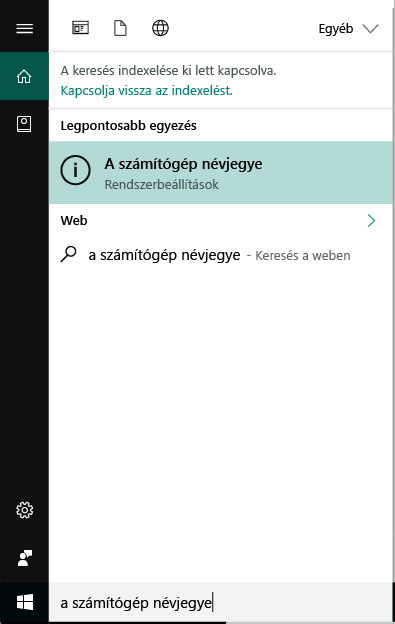
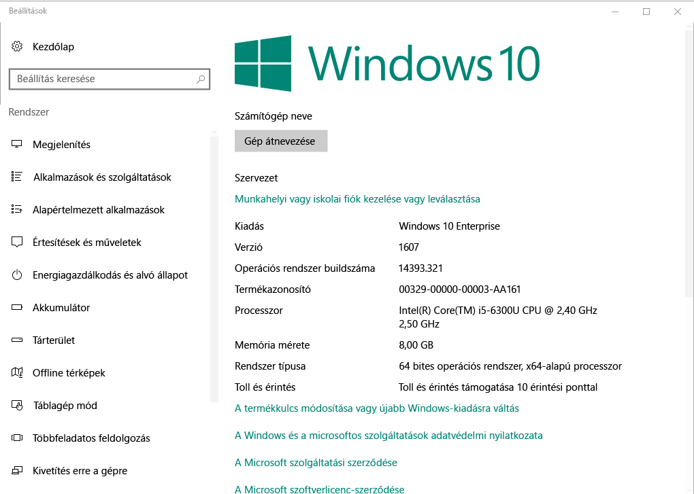

# Windows-eszközök beléptetése Intune Céges portál  

Regisztrálja Windows-eszközét a Intune Céges portál alkalmazásban, hogy biztonságos hozzáférést kapjon a munkahelyi és iskolai alkalmazásokhoz, e-mailekhez és fájlokhoz. Ha a szervezete bizonyos alkalmazásokat (például Office-vagy OneDrive) igényel, a regisztráció során fogadja őket, vagy Céges portál a regisztráció után elérhetővé válik.  

A Windows 10-es eszközök regisztrálása a Céges portál webhelyről *vagy* alkalmazásból végezhető el. Ha egy korábbi Windows-verzióval rendelkező eszközt regisztrál, regisztrálnia kell az eszközt a Céges portál webhelyén.  

## Céges portál alkalmazás telepítése  
Lehetséges, hogy már telepítette a Céges portál alkalmazást az eszközére. A __minden alkalmazás__ listában keresse meg az alkalmazást.  Ha nem látja Céges portál az alkalmazások listájában, akkor az alábbi lépéseket követve telepítheti.  

1. **Microsoft Store** megnyitása az eszközön.

2. A **Keresés** mezőbe írja be a következőt: **céges portál**.

3. Az eredménylistában válassza a **Céges portál** > **Telepítés** elemet.

4. Válassza a **Telepítés** vagy az **Ingyenes** lehetőséget. A két lehetőség között nincs különbség; a szavak annak alapján jelennek meg, hogy a szervezet hogyan állította be az alkalmazást.  

## A Windows 10-es verziószámának megkeresése  
A regisztrációs lépések eltérnek a Windows 10-es eszközök különböző verzióiban. A következő lépések azt ismertetik, hogyan lehet megkeresni a verziószámot a Windows 10-es asztali és mobil eszközein. Ha ismeri a verzióját, folytassa a javasolt regisztrációs lépésekkel.  

### Windows 10 rendszerű asztali eszközök  

1. Lépjen a **Start** menüre.

2. A keresősáv mezőbe írja be a "Névjegy a SZÁMÍTÓGÉPéről" kifejezést. Az eredmények közül válassza ki __a számítógép névjegye__ elemet.  

     

3. Görgessen le a **Windows-specifikációk** között, és keresse meg a számítógépen telepített Windows 10 **verzióját** .  

     

4. Ha a verziója  

    * __1607 vagy újabb__: regisztrálja az eszközt a [ **Beállítások** > **fiók** > **hozzáférési munkahelyi vagy iskolai** útvonalon](enroll-windows-10-device.md#enroll-windows-10-version-1607-and-later-device).   
    * __1511 vagy korábbi__: regisztrálja az eszközt a [ **Beállítások** > **fiók**@no__t a**fiókok** útvonalán](enroll-windows-10-device.md#enroll-windows-10-version-1511-and-earlier-device).  

### Windows 10 Mobile rendszerű eszközök

1. Lépjen a __minden alkalmazás__ elemre, és válassza ki a __Beállítások__ alkalmazást.
2. Válassza a __Rendszer__ > __Névjegy__ lehetőséget.
3. Az __eszköz adatai__alatt keresse meg a __verziót__.  
4. Ha a verziója  

    * __1607 vagy újabb__: regisztrálja az eszközt a [ > **hozzáférési munkahelyi vagy iskolai** útvonalon](enroll-windows-10-device.md#enroll-windows-10-version-1607-and-later-device).   
    * __1511 vagy korábbi__: regisztrálja az eszközt a [ > **accounts** Route **Beállítások**](enroll-windows-10-device.md#enroll-windows-10-version-1511-and-earlier-device)használatával.  

## Nem Windows 10-es eszközök regisztrálása  
A következő cikkek használatával regisztrálhat más támogatott Windows-eszközöket a Céges portál webhelyről:   
* [Windows 8,1. vagy Windows RT 8,1-eszköz](enroll-your-W81-or-rt81-windows.md)  
* [Windows Phone-telefon 8,1-eszköz](enroll-your-wp81-windows.md)    

## INFORMATIKAI rendszergazda támogatása  
Ha Ön rendszergazda, és az eszközök regisztrálása során problémákba kerül, tekintse meg [a Windows-eszközök regisztrálásával kapcsolatos problémák elhárítása Microsoft Intune](https://support.microsoft.com/help/4469913). Ez a cikk a gyakori hibákat, azok okait és a megoldás lépéseit sorolja fel.  

## További lépések  
Most, hogy már ismeri a támogatott eszközöket és a Windows 10-es verziószámát, folytassa a javasolt regisztrációs cikkel.  
 
Az eszközkezelés, a Céges portál és a mindkettő használatáról az iskolákban és a munkahelyeken a következő cikkekben talál további információt:  
* [A felügyelt eszközök használata a munkahelyi vagy iskolai erőforrásokhoz való hozzáféréshez](use-managed-devices-to-get-work-done.md)  
* [Mi történik, amikor regisztrálja az eszközt az Intune-ban](what-happens-if-you-install-the-company-portal-app-and-enroll-your-device-in-intune-windows.md)  
* [Milyen információkat tekinthet meg a szervezetem az eszköz regisztrálásakor?](what-info-can-your-company-see-when-you-enroll-your-device-in-intune.md)  

Segítségre van szüksége? Forduljon a cég informatikai támogatásához. [Lépjen a céges portál webhelyére](https://go.microsoft.com/fwlink/?linkid=2010980) , ahol megkeresheti a szervezet informatikai kapcsolattartási adatait.  
